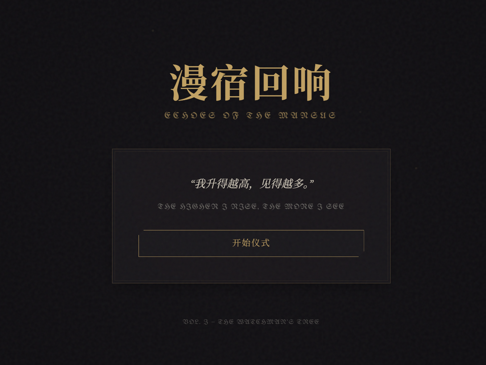

# 🕯️ 漫宿回响：寻觅你命定的司辰 (Which Hour Will You Serve?)

> “世界不仅是它现在的样子，也是它过去的样子，更是它将被书写的样子。”

<div align="center">

[](https://github.com/luyu14039/Which-hour-will-you-serve)

**如果你喜欢这个项目，请给它一个 Star ⭐️！**

</div>

这是一个基于 **《密教模拟器 (Cultist Simulator)》** 和 **《司辰之书 (Book of Hours)》** 世界观（秘密历史）的同人二创互动网页。通过一系列带有叙事色彩的抉择，探索你灵魂深处的渴望，寻找那位在漫宿（Mansus）中注视着你的 **司辰 (Hour)**。



## 📖 项目简介

在这个应用中，你将经历一段神秘的旅程。从一份尘封的遗产开始，你的每一个选择都对应着不同的 **性相 (Principles)** —— 灯、铸、刃、冬、心、杯、蛾、启，或是秘史。

系统会根据独特的加权算法，分析你的选择倾向，最终揭示最适合你的司辰。是追求无情真理的 **瞳中之扉**？还是在毁灭中新生的 **轰雷之皮**？亦或是保守秘密的 **丝绒**？

## 📸 预览

| 抉择时刻 | 揭示命运 |
|:---:|:---:|
|  |  |
| *沉浸式的叙事问答* | *精美的结果卡片与分析* |

## ✨ 特性

*   **沉浸式体验**：模仿原作的晦涩、神秘文案风格，带你重返那个充满雨水与低语的伦敦。
*   **复杂的匹配算法**：
    *   不仅仅是简单的分数累加，算法考虑了主性相与副性相的权重。
    *   包含“协同加成”机制，奖励那些与司辰复杂性相匹配的灵魂。
*   **精美的视觉效果**：
    *   使用 Tailwind CSS 构建的响应式界面。
    *   Framer Motion 带来的流畅转场与卡片翻转动画。
*   **完全类型安全**：基于 TypeScript 开发，确保逻辑严密。

## 🛠️ 技术栈

*   **核心框架**: [React 19](https://react.dev/)
*   **构建工具**: [Vite](https://vitejs.dev/)
*   **语言**: [TypeScript](https://www.typescriptlang.org/)
*   **样式**: [Tailwind CSS](https://tailwindcss.com/)
*   **动画**: [Framer Motion](https://www.framer.com/motion/)
*   **图标**: [Lucide React](https://lucide.dev/)

## 🚀 快速开始

如果你想在本地运行此项目：

1.  **克隆仓库**
    ```bash
    git clone https://github.com/luyu14039/Which-hour-will-you-serve.git
    cd Which-hour-will-you-serve
    ```

2.  **安装依赖**
    ```bash
    npm install
    ```

3.  **启动开发服务器**
    ```bash
    npm run dev
    ```

4.  打开浏览器访问 `http://localhost:5173`。

## 📜 版权与免责声明

本项目为 **Weather Factory** 旗下游戏《密教模拟器》与《司辰之书》的同人二创作品。

*   **世界观与设定**：归属于 [Weather Factory](https://weatherfactory.biz/)。
*   **图片素材**：部分素材来源于游戏原作或网络，仅用于非商业交流与学习。
*   **开源协议**：MIT License (代码部分)。

---

*“虽然我们侍奉不同的神，但我们都渴望同一个太阳。”*
